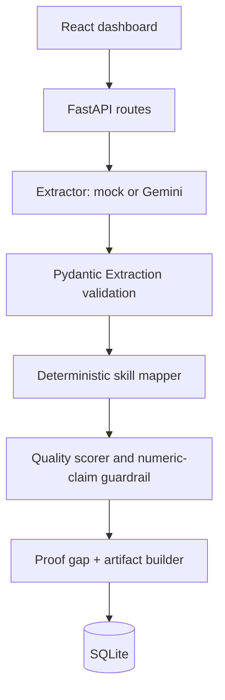

# Architecture

## Responsibilities and request flow

`POST /analyze` accepts a bounded Pydantic request and returns the pipeline result. `POST /build` runs exactly the same pipeline and persists input, analysis, artifact, role, and timestamp in one SQLite record. `GET /{id}` returns the stored structured artifact.

The extractor is the only provider-dependent component. In mock mode it detects actions/tools predictably; in live mode it calls Gemini and validates JSON with `Extraction(extra='forbid')`. Any provider, timeout, parsing, or validation failure becomes a safe 503, never partial data.

## Deterministic evidence rules

For every user-listed skill, a text/tool match + at least one action + supplied evidence produces L3/Strong/Proven. A text match without supplied proof gives L2/Moderate/Implied. A listed unmatched skill is L0/None/Claimed. These rules give the exact target demo: SQL, Excel and Data Analysis Proven; Python Claimed.

The seven score dimensions are [relevance, depth, ownership, outcome, verifiability, recency, transferability] with weights [.20, .15, .15, .15, .15, .10, .10]. Scores are bounded 0–1. High is ≥.75, Moderate ≥.45, otherwise Low. Missing dates use a transparent neutral .70 recency value.

Proof gaps are all non-Proven skills, with a skill-specific mini-project recommendation and required repository/output/README/reflection. Numeric outcome language without corroborating evidence is labeled unsupported and excluded from the final artifact outcome list.

## Database, errors, security, and testing

`proofs` holds JSON input, analysis, artifact, role, and creation time; JSON keeps the MVP small while retaining a full audit record. Inputs have lengths/enums; the server never executes user content. Secrets are environment-only and ignored by Git. Error messages are user-safe.

Tests cover successful mocked extraction, mapping, quality range, unsupported numbers, validation, safe LLM failure, persistence, and retrieval. At scale, replace SQLite with PostgreSQL, enqueue LLM work, add object storage, rate limits, authentication, metrics, tracing, model/prompt versions, and human review.
